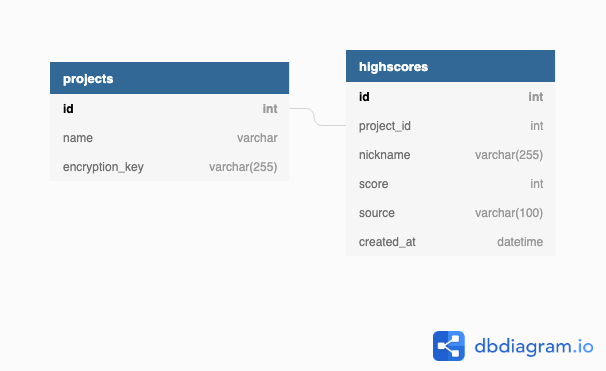

# Node Score API

Dockerized API for high scores. Data sending to API is AES encrypted to fight with score tampering.

## Schema



## There are two api endpoints

---

`POST /score/:name` 

Where the `:name` variable is a project name. 

You need to send data in a following format:

```json
{
    "data": "U2FsdGVkX1+uWyn+yG7xd5VI44GnQnCUK8oprXTmAuh1SjL1MbUqVD2h1vOG/8yoZ6QwmTWAdstinjGxz899Vmrltz8vcDGf5RuVWCKeIBo="
}
```

With `content-type` header set to `application/json`.

---

`GET /score/:name/:count` 

Where the `:name` is a project name and `:count` is a number of returned rows.

---

## Configuration

Remember that there are two `.env` files. One is for the `Docker` and another one is for local (yarn start). You can run only database container, if you wish :)

### How to get Docker container db ip

1. Execute `docker network ls` to see how many bridge drivers you have. In my case i had 2 and containers where using different ones
2. If you have multiple bridge drivers, make sure that you starting your containers which will be talking with each other using same bridge network docker `run -d -t --network networkname  --name containername`
3. Run `docker network inspect networkname`. You will see details of network with list of containers. Each container will have IPv4Address associated with it. Use value of these address to communicate instead of localhost or 127.0.0.1

## Local commands (Docker)

* `bin/run.sh` — run or initial build.
* `bin/stop.sh` — stop.
* `bin/run-db.sh` — run db only (can be used with `yarn start`).
* `bin/build.sh` — update build.

## Yarn commands

Available commands:

* `yarn start` — run app.
* `yarn lint` — list linter errors/warnings.
* `lint-and-fix` — run linter and fix errors.
* `format` — run prettier.
